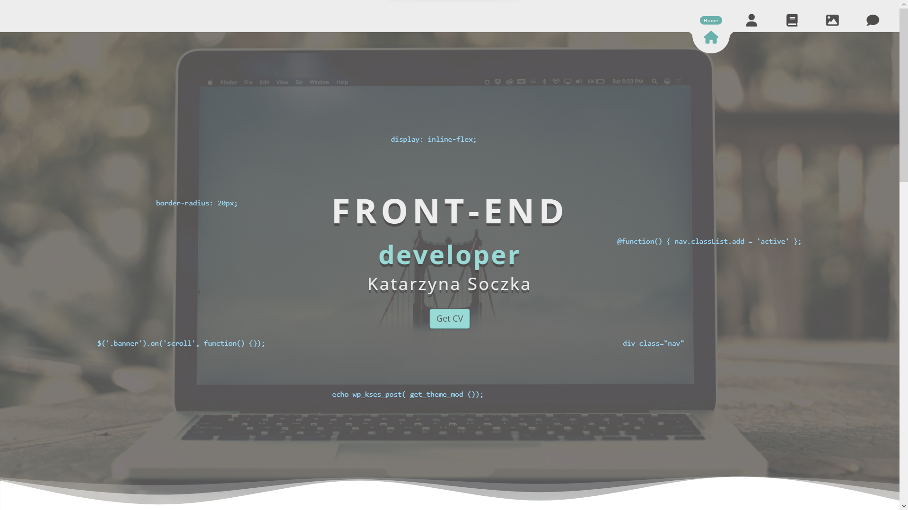

# Porftolio - Katarzyna Soczka

This is static one-page site with portfolio section. It is build to practice my new Wordpress skill and will be changed to dynamic page in the future. 

## Table of contents

- [Overview](#overview)
  - [Screenshot](#screenshot)
  - [Links](#links)
- [Built with](#built-with)
- [Author](#author)
- [Used plugins](#used-plugins)

**Note: Delete this note and update the table of contents based on what sections you keep.**

## Overview

### Screenshot

### Links

- GitHub: [Add solution URL here](https://your-solution-url.com)
- Live Demo: [Add live site URL here](https://your-live-site-url.com)

## Built with

- Bootstrap
- Sass
- Responsive web seigning

## Author

- Katarzyna Soczka

## Used plugins

- Animate.css
- Parallax.js

